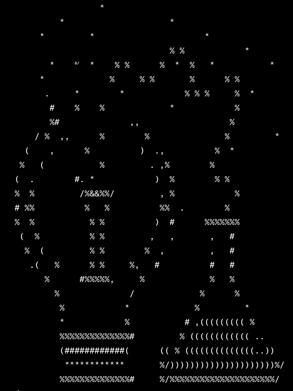

#  Elzabé Els

<table style="border-collapse: collapse; width: 100%;">
<tr>
<td>
<h2> 🔭 Currently Working On </h2>
<li>
<a href="https://www.coursera.org/learn/computational-neuroscience">Coursera Computational Neuroscience Course</a>
</li>
 
<h2> 🌱🌱 Currently Learning 🌱🍃🍃 </h2>
<li>
 Python in Jupyter Notebook
</li>
<li>
 Next.js
</li>
<li>
 React
</li>
<li>
 TypeScript
</li>
  
<h2> 🧠🏋️‍♀️ Looking to Collaborate On 🏋️‍♀️🏋️‍♂️ </h2>
<li>
Any project that integrates Mathematics, Biology, Engineering and Psychology
</li>
 
<h2> 💃💃 Skills 💃💃 </h2>
           
 
</td>
            
<td>
 
            

</td>
</tr>
</table>
